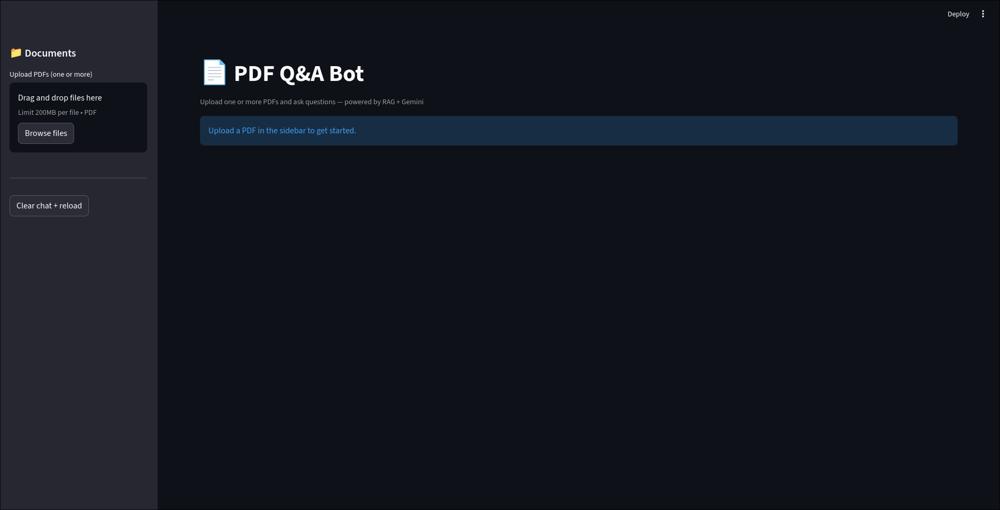
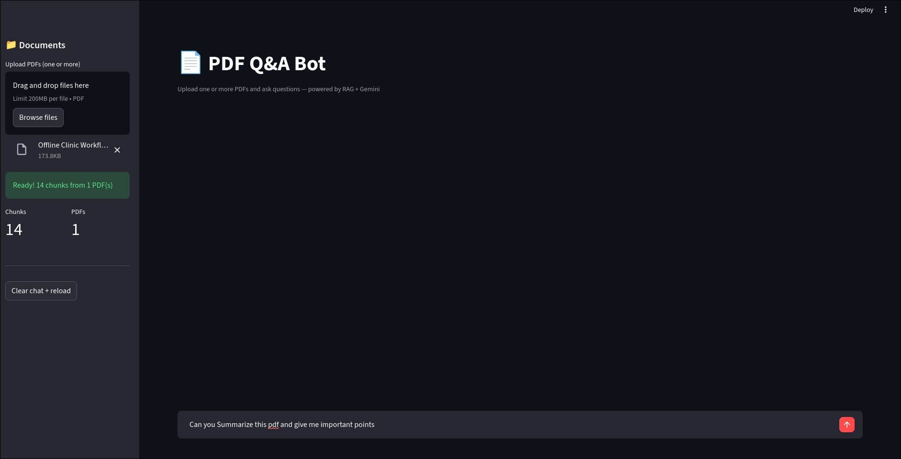
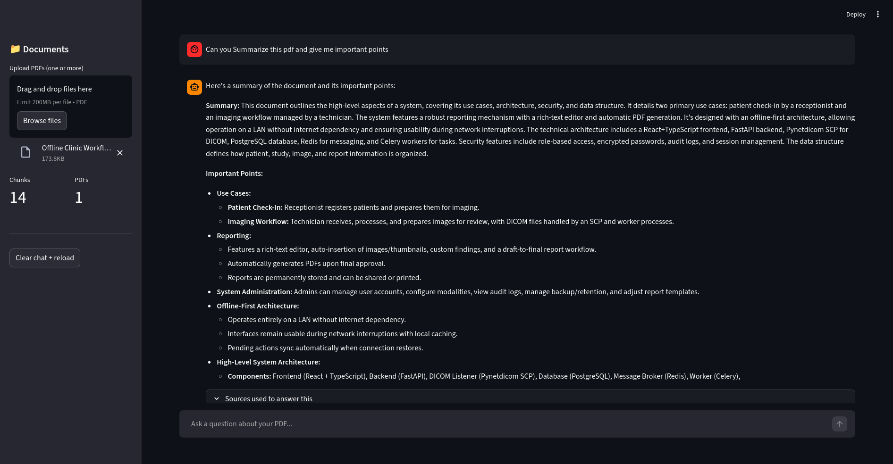
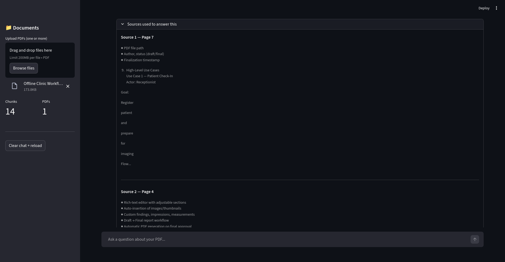

# AI Document Assistant

> Upload any PDF and chat with it using AI.

## Live Demo
[Try it here](https://ai-document-assistant-6knykve2lc5dxwpuqwfspb.streamlit.app/)

## Features
- Multi-PDF upload and indexing
- Ask questions in plain English
- Answers with exact page references
- Full chat history
- Download conversation as .txt
- Dark mode UI

## How it works
1. PDF split into 1000-char chunks
2. Chunks embedded with HuggingFace
3. FAISS finds top 4 relevant chunks per question
4. Gemini answers using only those chunks (RAG)

## Tech Stack
Python · LangChain · FAISS · HuggingFace
Google Gemini API · Streamlit

## Setup
git clone https://github.com/YOU/pdf-qa-bot
cd pdf-qa-bot
pip install -r requirements.txt or uv sync
# Add GEMINI_API_KEY to .env
streamlit run app.py

## Use Cases
- Legal contract analysis
- Technical documentation Q&A
- Research paper summarization
- Company policy chatbots